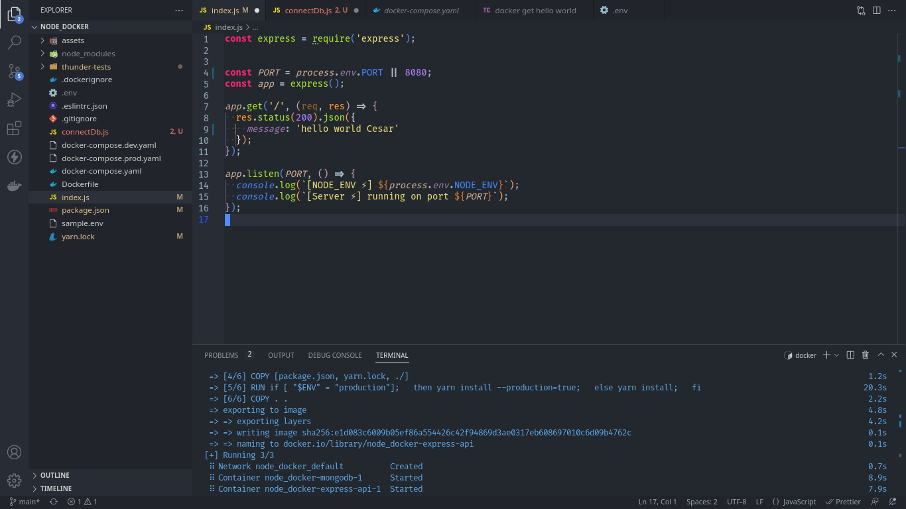

# LarnU Fullstack Bootcamp

## NODE_DOCKER REST API WITH REDIS AND MONGO DBS

Express, node, jest testing, supertest, github actions ci/cd postgres, mongoDB, redisDB, mongoos and much more.

- To create, delete or update a TODO requires authentication.
- Protected endpoints.
- RedisStore, express-session based athentication

 

## BLOG API

To start your dev environment on the cli run:

- docker-compose -f docker-compose.yaml -f docker-compose.dev.yaml up

- docker logs --follow node_docker-express-api-1

To stop:

- docker-compose -f docker-compose.yaml -f docker-compose.dev.yaml down

- docker-compose stop

 

